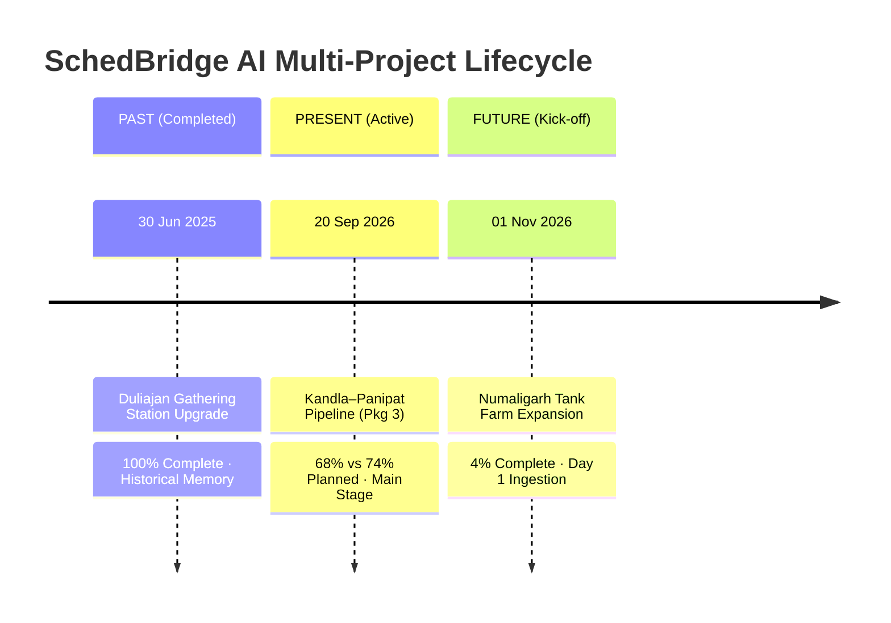

# SchedBridge AI — Demo Projects & User Personas

**System**: SchedBridge AI (Yatharth)
**Hackathon Problem Statement**: SIH 26122 (Oil India Limited)

---

## 1. Demo Project Worlds (Temporal Triad)

SchedBridge AI structures demo data across three distinct EPC project lifecycles representing **Past**, **Present**, and **Future**. This proves system versatility from project kick-off to historical institutional recall.

---

### Project 1: Kandla–Panipat Pipeline — Package 3 (PRESENT / ACTIVE)
* **Role in Narrative**: **The Main Stage** — Primary environment for the Golden Demo Script.
* **Project ID**: `kandla-panipat-p3`
* **Data Date ("Today")**: `20 Sep 2026`
* **Lifecycle Status**: Active Execution (~68% physical complete vs 74% planned baseline).
* **Scope**: 10 km cross-country pipeline execution package (KP 178.0 to KP 188.0) including 4 HDD river crossings, 2 valve stations, and refinery tie-in spools.
* **Key Metrics**:
  * **SPI**: `0.92` (Critical path slip identified on pipe welding)
  * **Truth Gap**: `3%` (Contractor DPR claims 71% vs verified physical progress of 68%)
  * **Active Activities**: 14 activities in progress across Civil, Mechanical, Piping, and NDT disciplines.

---

### Project 2: Duliajan Gathering Station Upgrade (PAST / COMPLETED)
* **Role in Narrative**: **Institutional Memory & Benchmarking** — Historical reference database.
* **Project ID**: `oil-duliajan-gs`
* **Data Date**: `30 Jun 2025`
* **Lifecycle Status**: Completed (100% physically verified and commissioned).
* **Scope**: Brownfield gas separation and gathering station upgrade in Upper Assam with high monsoon precipitation risk profile.
* **Demo Utility**:
  * Provides historical delay cause distributions (e.g. monsoon logistics, vendor inspection hold points).
  * Surfaces automated lessons-learned recommendations in the *Memory Insights Drawer* when active projects encounter similar activity codes.

---

### Project 3: Numaligarh Tank Farm Expansion (FUTURE / KICK-OFF)
* **Role in Narrative**: **Day-One Onboarding & Zero-State Verification** — Closing pitch beat.
* **Project ID**: `numaligarh-tank-farm`
* **Data Date**: `01 Nov 2026`
* **Lifecycle Status**: Mobilization / Early Stage (4% progress, foundation excavation).
* **Scope**: Construction of four 50,000 m³ crude oil storage tanks, floating roof assemblies, and bund walls.
* **Demo Utility**:
  * Demonstrates that SchedBridge AI requires zero complex pre-training: importing a raw Primavera P6 `.XER` schedule enables instant voice logging and matching on Day 1 of a new capital project.

---

## 2. Demo User Personas

The application features four canonical role-based demo accounts. Users can switch between these roles instantly via the Profile screen (`/profile`) without losing stored data or reset states.

---

### Persona 1: Rahul Patil — Field Supervisor
* **Employee ID**: `SUP-0412`
* **Organization**: Oil India Pipeline Division (Site Execution)
* **Role**: `supervisor`
* **Primary Responsibilities**:
  * Conducts daily site walk-throughs across active chainages.
  * Records hands-free multilingual voice progress updates and attaches photographic evidence.
  * Clarifies queries raised by the central planning office regarding joint numbers or spool IDs.
* **Key Demo Screens**:
  * `/home` (Supervisor quick stats & today's crew logs)
  * `/capture` (One-tap voice recording with multilingual transcription)
  * `/reports` (Personal and crew submission history)

---

### Persona 2: Meera Nair — Project Controls Planner
* **Employee ID**: `PLN-0107`
* **Organization**: Central Project Management Cell (CPMC)
* **Role**: `planner`
* **Primary Responsibilities**:
  * Reviews incoming AI-extracted schedule matches in the triage queue.
  * Approves, rejects, or rematches field events to Primavera P6 activities.
  * Sends clarification questions back to field supervisors when evidence is ambiguous.
  * Validates physical progress percentages and commits updates to the schedule baseline.
* **Key Demo Screens**:
  * `/workbench` (High-efficiency event review queue with hotkeys `A`, `C`, `U`, `J`/`K`)
  * `/project/kandla-panipat-p3` (Detailed WBS activities & evidence review)
  * `/event/[id]` (AI confidence breakdown and conversation threads)

---

### Persona 3: Arvind Deshmukh — Project Manager
* **Employee ID**: `PM-0031`
* **Organization**: Oil India Executive Project Directorate
* **Role**: `pm`
* **Primary Responsibilities**:
  * Monitors macro project health, schedule variance, and critical path slip.
  * Analyzes contractor truth gaps and delay attribution categories.
  * Evaluates institutional memory recommendations to mitigate forecast delays.
* **Key Demo Screens**:
  * `/analytics` (S-Curves, SPI trends, Truth Gap analysis, and Delay Cause pareto)
  * `/audit` (Cryptographic tamper-proof provenance trail)
  * `/export` (Schedule progress export packages in XER/XLSX formats)

---

### Persona 4: Sana Qureshi — Project Administrator
* **Employee ID**: `ADM-0002`
* **Organization**: Enterprise IT & Project Systems
* **Role**: `admin`
* **Primary Responsibilities**:
  * Governs AI matching confidence thresholds and triage routing parameters.
  * Configures locked Primavera P6 business rules (Retained Logic, Physical % complete).
  * Manages engineering dictionaries, aliases, and offline queue synchronization.
* **Key Demo Screens**:
  * `/settings` (Confidence slider calibration & live tier distribution preview)
  * `/admin/dictionary` (Industry jargon and site-specific synonym mappings)
  * `/admin/users` (Role-based access management)

---

## 3. Persona Summary Matrix

| Persona Name | Employee ID | Role | Key Goal / Responsibility | Primary Screen |
| :--- | :--- | :--- | :--- | :--- |
| **Rahul Patil** | `SUP-0412` | Field Supervisor | Fast voice reporting & photo capture | `/capture` |
| **Meera Nair** | `PLN-0107` | Project Controls Planner | Triage AI matches & commit P6 progress | `/workbench` |
| **Arvind Deshmukh** | `PM-0031` | Project Manager | Monitor SPI, Truth Gap, & S-Curves | `/analytics` |
| **Sana Qureshi** | `ADM-0002` | Project Administrator | Configure AI thresholds & P6 rules | `/settings` |
